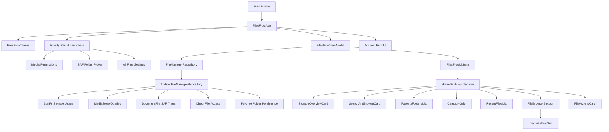

# FilesFlow - fast and elegant android file manager


FilesFlow is a native Android file manager built with Kotlin and Jetpack Compose. It gives users a warm portrait dashboard for checking device storage, browsing common file categories, searching files, reviewing recent files, opening files with Android apps, printing images/PDF documents through Android's print UI, and managing files with copy, move, rename, and delete actions through Android storage access.

FilesFlow is a native Android app and is not deployed as a hosted web service.

## Screenshots

The screenshot below was captured from the debug APK running on a connected Android device.


## Functionality

FilesFlow currently includes a status-bar-safe portrait app bar, a real internal-storage usage overview, live file-category summaries for Images, Videos, Docs, Downloads, Music, and Apps, a recent-files feed backed by MediaStore or granted shared storage, search-by-name after Enter, category browsing with swipeable folder filters, SAF folder browsing, Android file opening on tap, long-press multi-select with batch move/delete/share actions, and per-file copy, move, rename, delete, and print actions from the more menu. Tapping the Internal Storage overview opens the phone folder root. Categories, search results, and browsing open as dedicated views with back navigation to the home dashboard, and the Images category uses a fast cached 3 x 6 thumbnail gallery with selection controls in grid view. Copy and move use FilesFlow's own Browse Files view to choose a destination, with favorite folders shown first as one-tap destination proposals and a bottom-right validation button for the current folder.

Favorite folders can be starred or unstarred directly from folder rows or the file action sheet. Starred folders appear on the home dashboard and are prioritized as move/copy destinations. Images print through Android's image printing helper, and PDFs are passed into Android's system print UI so users can choose available printers or Save as PDF.

The interface keeps the original FilesFlow design language: warm `#fff8f2` surfaces, serif headline typography, compact portrait spacing, rounded 8-12dp controls, and raised or recessed neumorphic panels.

## Architecture



`FilesFlowApp` owns Android permission launchers, print actions, and file open/share actions, `FilesFlowViewModel` owns dashboard, browser, selection, favorite-folder, and in-app destination-picking state, `AndroidFileManagerRepository` performs storage, MediaStore, SAF, direct-file, app-package, and favorite-folder persistence operations, and the `features/home/components` package renders the portrait-only Compose UI.

## Installation

### Install the debug APK from a local build

```powershell
.\gradlew.bat assembleDebug
adb install -r app\build\outputs\apk\debug\app-debug.apk
```

FilesFlow asks for Android system access only when the user opens a category, search, or browser that needs it. Tap a file to open it with Android, or long-press a file to manage it. Use the file action sheet or the multi-select folder action to open Browse Files, navigate to a destination folder, and validate it with the bottom-right button. Star folders in Browse Files to make them appear on Home and as first-choice copy/move destinations. Use Print / Save as PDF on printable images and PDFs to open Android's native print picker.

### Run from Android Studio

Open this repository in Android Studio, let Gradle sync, select the `app` configuration, connect an Android device or emulator in portrait orientation, and run the app.

### Verify locally

```powershell
.\gradlew.bat test
.\gradlew.bat assembleDebug
```
