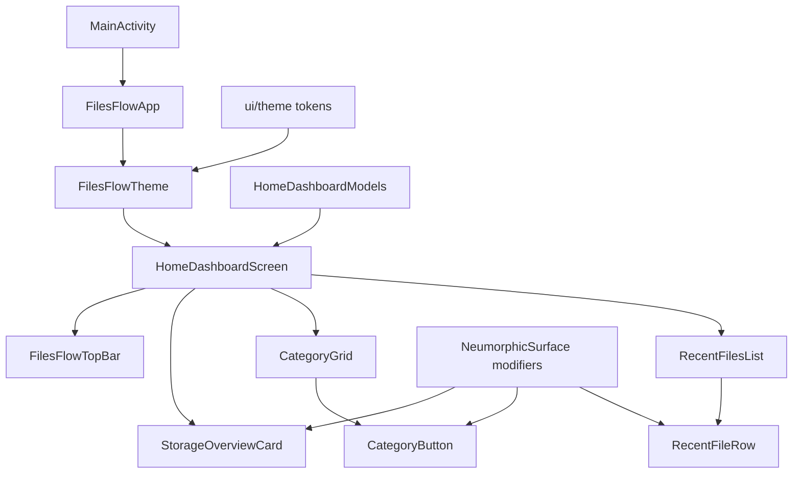

# FilesFlow


FilesFlow is an Android file manager built with Kotlin and Jetpack Compose. The current app gives users a clean home dashboard for understanding internal storage, jumping into common file categories, and returning to recent files quickly.

FilesFlow is a native Android app and is not deployed as a hosted web service.

## Screenshots

The screenshot below was captured from the debug APK running on a connected Android device.


## Functionality

FilesFlow currently includes a fixed app bar with menu and search actions, an internal storage overview card, a six-category file grid for Images, Videos, Docs, Downloads, Music, and Apps, and a recent-files list with file metadata and overflow actions. The interface uses a warm light theme, serif headline typography, and neumorphic raised and recessed surfaces.

This first Android version focuses on the home dashboard. Real device storage readings, live media/category queries, file browsing, copy/move/delete flows, permissions handling, and search execution are later feature phases.

## Architecture



The app keeps presentation components small and data for this phase static. `HomeDashboardModels.kt` owns the dashboard labels and file rows, `ui/theme` owns the FilesFlow color and typography tokens, and the `components` package owns reusable Compose pieces such as the top bar, storage card, category buttons, recent rows, and neumorphic surface drawing.

## Installation

### Install the debug APK from a local build

```powershell
.\gradlew.bat assembleDebug
adb install -r app\build\outputs\apk\debug\app-debug.apk
```

### Run from Android Studio

Open this repository in Android Studio, let Gradle sync, select the `app` configuration, connect an Android device or emulator, and run the app.

### Verify locally

```powershell
.\gradlew.bat test
.\gradlew.bat assembleDebug
```
