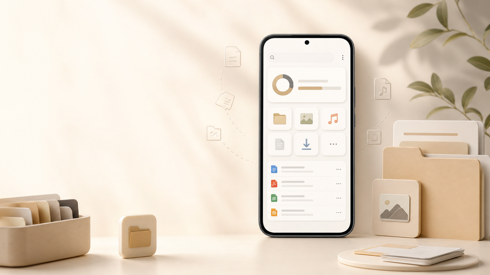
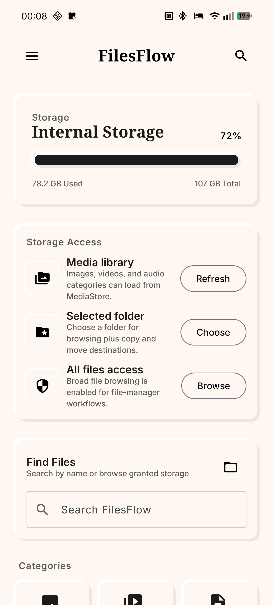
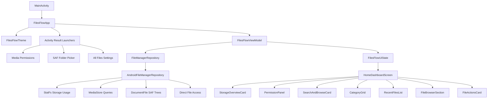

# FilesFlow



FilesFlow is a native Android file manager built with Kotlin and Jetpack Compose. It gives users a warm portrait dashboard for checking device storage, browsing common file categories, searching files, reviewing recent files, and performing copy, move, and delete actions through Android storage access.

FilesFlow is a native Android app and is not deployed as a hosted web service.

## Screenshots

The screenshot below was captured from the debug APK running on a connected Android device.



## Functionality

FilesFlow currently includes a status-bar-safe portrait app bar, a real internal-storage usage overview, live file-category summaries for Images, Videos, Docs, Downloads, Music, and Apps, a recent-files feed backed by MediaStore, search-by-name, category browsing, SAF folder browsing, and selected-file actions for copy, move, and delete. It also guides users through Android media permissions, Storage Access Framework folder selection, and all-files-access settings when broader browsing or file operations require them.

The interface keeps the original FilesFlow design language: warm `#fff8f2` surfaces, serif headline typography, compact portrait spacing, rounded 8-12dp controls, and raised or recessed neumorphic panels.

## Architecture



`FilesFlowApp` owns Android permission and picker launchers, `FilesFlowViewModel` owns dashboard and browser state, `AndroidFileManagerRepository` performs storage, MediaStore, SAF, direct-file, and app-package operations, and the `features/home/components` package renders the portrait-only Compose UI.

## Installation

### Install the debug APK from a local build

```powershell
.\gradlew.bat assembleDebug
adb install -r app\build\outputs\apk\debug\app-debug.apk
```

After launching the app, use the permission panel to grant media access, choose a SAF folder for folder browsing plus copy/move destinations, and open Android all-files-access settings when broader local file browsing is needed.

### Run from Android Studio

Open this repository in Android Studio, let Gradle sync, select the `app` configuration, connect an Android device or emulator in portrait orientation, and run the app.

### Verify locally

```powershell
.\gradlew.bat test
.\gradlew.bat assembleDebug
```
