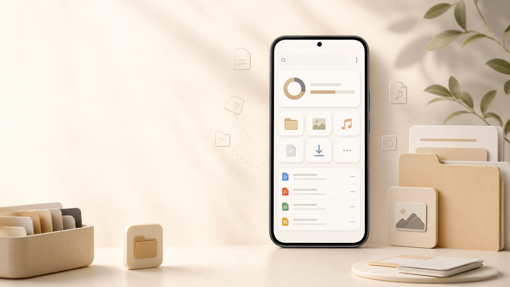
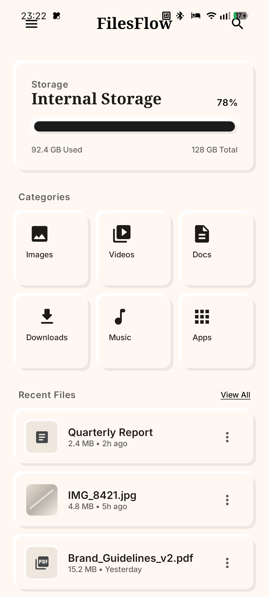
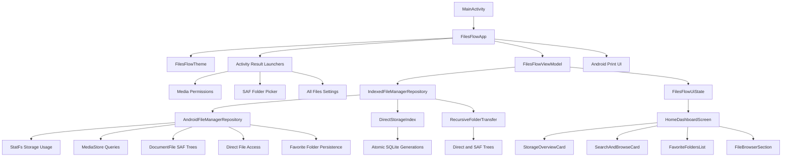

# FilesFlow - fast and elegant android file manager



FilesFlow is a native Android file manager built with Kotlin and Jetpack Compose. It gives users a warm portrait dashboard for checking device storage, browsing common file categories, searching files, reviewing recent files, opening files with Android apps, printing images/PDF documents through Android's print UI, and managing files with copy, move, rename, and delete actions through Android storage access.

FilesFlow is a native Android app and is not deployed as a hosted web service.

## Screenshots

The screenshot below was captured from the debug APK running on a connected Android device.



## Functionality

FilesFlow currently includes a status-bar-safe portrait app bar, a real internal-storage usage overview, live file-category summaries for Images, Videos, Docs, Downloads, Music, and Apps, a recent-files feed backed by MediaStore or granted shared storage, search-by-name after Enter, category browsing with swipeable folder filters, SAF folder browsing, Android file opening on tap, long-press multi-select with batch move/delete/share actions, and per-file copy, move, rename, delete, and print actions from the more menu. Tapping the Internal Storage overview opens the phone folder root. Categories, search results, and browsing open as dedicated views with back navigation to the home dashboard, and the Images category uses a fast cached 3 x 6 thumbnail gallery with selection controls in grid view. Copy and move use FilesFlow's own Browse Files view to choose a destination, with favorite folders shown first as one-tap destination proposals and a bottom-right validation button for the current folder.

Favorite folders can be starred or unstarred directly from folder rows or the file action sheet. Starred folders appear on the home dashboard and are prioritized as move/copy destinations. Images print through Android's image printing helper, and PDFs are passed into Android's system print UI so users can choose available printers or Save as PDF.

Files and complete folder trees can be copied or moved between direct shared storage and SAF locations. Recursive transfers reject a source folder as its own destination, reject descendant destinations, generate collision-safe names for every file and folder, and remove incomplete destination trees when copying fails. Move operations delete the original only after the complete destination tree has been written; if Android refuses deletion, FilesFlow reports a successful copy while preserving the original.

With broad file access, FilesFlow builds a complete private SQLite index of readable shared-storage files instead of relying on capped scans. Each refresh generation is committed atomically, so an interrupted scan leaves the previous complete index available. Dashboard category counts and sizes are computed over the full index; category and search screens use bounded result windows for responsive rendering while querying the complete dataset. Copy, move, rename, and delete operations invalidate the index so the next repository query rebuilds it.

The interface keeps the original FilesFlow design language: warm `#fff8f2` surfaces, serif headline typography, compact portrait spacing, rounded 8-12dp controls, and raised or recessed neumorphic panels.

## Architecture


```mermaid
flowchart TD
    A["MainActivity"] --> B["FilesFlowApp"]
    B --> C["FilesFlowTheme"]
    B --> D["Activity Result Launchers"]
    D --> E["Media Permissions"]
    D --> F["SAF Folder Picker"]
    D --> G["All Files Settings"]
    B --> H["FilesFlowViewModel"]
    H --> I["IndexedFileManagerRepository"]
    I --> J["AndroidFileManagerRepository"]
    I --> K["DirectStorageIndex"]
    I --> L["RecursiveFolderTransfer"]
    K --> M["Atomic SQLite Generations"]
    L --> N["Direct and SAF Trees"]
    J --> O["StatFs Storage Usage"]
    J --> P["MediaStore Queries"]
    J --> Q["DocumentFile SAF Trees"]
    J --> R["Direct File Access"]
    J --> S["Favorite Folder Persistence"]
    B --> T["Android Print UI"]
    H --> U["FilesFlowUiState"]
    U --> V["HomeDashboardScreen"]
    V --> W["StorageOverviewCard"]
    V --> X["SearchAndBrowseCard"]
    V --> Y["FavoriteFoldersList"]
    V --> Z["FileBrowserSection"]
```

`FilesFlowApp` owns Android permission launchers, saved stable routes, print actions, and file open/share actions. `FilesFlowViewModel` owns dashboard, browser, selection, favorite-folder, and in-app destination-picking state. `IndexedFileManagerRepository` routes broad-access category summaries, category listings, and searches through the complete durable index, delegates single-file operations to `AndroidFileManagerRepository`, and uses `RecursiveFolderTransfer` for safe cross-storage folder trees. The `features/home/components` package renders the portrait-only Compose UI.

## Installation

### Install the debug APK from a local build

```powershell
.\gradlew.bat assembleDebug
adb install -r app\build\outputs\apk\debug\app-debug.apk
```

FilesFlow asks for Android system access only when the user opens a category, search, or browser that needs it. Tap a file to open it with Android, or long-press a file or folder to manage it. Use the file action sheet or the multi-select folder action to open Browse Files, navigate to a destination folder, and validate it with the bottom-right button. Star folders in Browse Files to make them appear on Home and as first-choice copy/move destinations. Use Print / Save as PDF on printable images and PDFs to open Android's native print picker.

### Run from Android Studio

Open this repository in Android Studio, let Gradle sync, select the `app` configuration, connect an Android device or emulator in portrait orientation, and run the app.

### Verify locally

```powershell
.\gradlew.bat testDebugUnitTest lintDebug lintRelease assembleDebug assembleRelease
```

The unsigned optimized release APK is generated at `app/build/outputs/apk/release/app-release-unsigned.apk` when no signing environment is configured.

## Release process

Every push and pull request runs JVM unit tests, Android lint for debug and release builds, debug APK assembly, optimized release APK assembly, and an API 35 hardware-accelerated emulator smoke test covering launch, Browse Files navigation, process recreation, and return navigation. GitHub Actions retains raw unit-test diagnostics, verification reports, instrumentation reports, the R8 mapping, the debug APK, and the unsigned release APK.

A tag matching `v*` starts the signed-release job only after both the standard verification job and the emulator smoke job pass. Configure all four repository secrets before creating the tag:

- `FILESFLOW_KEYSTORE_BASE64`: the release keystore encoded as one Base64 string;
- `FILESFLOW_KEYSTORE_PASSWORD`;
- `FILESFLOW_KEY_ALIAS`;
- `FILESFLOW_KEY_PASSWORD`.

Partial signing configuration is rejected. The tagged job decodes the keystore into the runner's temporary directory, builds the signed and optimized release APK, verifies its signature with `apksigner`, and attaches it to a GitHub release. The keystore and passwords are never written to the repository or uploaded as artifacts.
