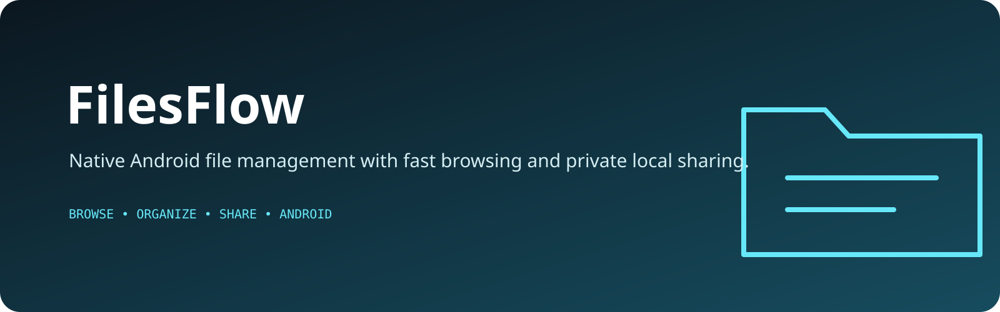

<p align="center">
  
</p>

# FilesFlow

FilesFlow is a native Android file manager focused on fast browsing, practical file operations, and private local-network sharing.

## Current capabilities

- Browse files through direct storage, MediaStore, and the Android Storage Access Framework.
- Persistent SQLite-backed file index for search, categories, recent files, and gallery views.
- Open, share, and print supported files.
- Copy, move, rename, and delete files and folders.
- Multi-select operations and mixed file/folder batch transfers.
- Favorite folders with fast destination suggestions.
- Recursive folder transfers.
- Local-network file sharing through a temporary tokenized HTTP session.
- One receiver link and QR code per transfer session.
- Responsive browser landing page with individual download buttons.
- Resumable downloads through strict single-range HTTP byte requests.

## Local-network transfer

1. Select one or more files.
2. Choose the local-network send action.
3. Keep the transfer screen open.
4. Connect the receiving device to the same Wi-Fi or local network.
5. Scan the QR code or open the single transfer link.
6. Download files from the responsive landing page.

The session expires automatically after ten minutes. FilesFlow serves only explicitly selected files and does not upload them to an external service.

The sender supports `Accept-Ranges: bytes`, `206 Partial Content`, and standards-compliant `416 Range Not Satisfiable` responses so browsers and download managers can resume large transfers. Multipart ranges are intentionally rejected.

## Architecture

```text
FilesFlowApp
    ↓
FilesFlowViewModel
    ↓
IndexedFileManagerRepository
    ↓
AndroidFileManagerRepository

Selected files
    ↓
LanTransferActivity
    ↓
LanTransferServer
    ├── Expiring tokenized HTTP routes
    ├── Strict single-range byte streaming
    ├── Responsive browser landing page
    └── QR / copy / share handoff
```

## Validation

GitHub Actions validates:

- JVM unit tests
- Android lint
- Debug APK assembly
- Optimized release APK assembly with R8
- API 35 emulator instrumentation tests
- Sender activity and QR rendering
- Binary-safe raw-socket verification of `206` and `416` responses through device loopback while preserving the real tokenized route and server port

Release signing is enabled when all four signing environment variables are supplied together:

- `FILESFLOW_KEYSTORE_PATH`
- `FILESFLOW_KEYSTORE_PASSWORD`
- `FILESFLOW_KEY_ALIAS`
- `FILESFLOW_KEY_PASSWORD`
